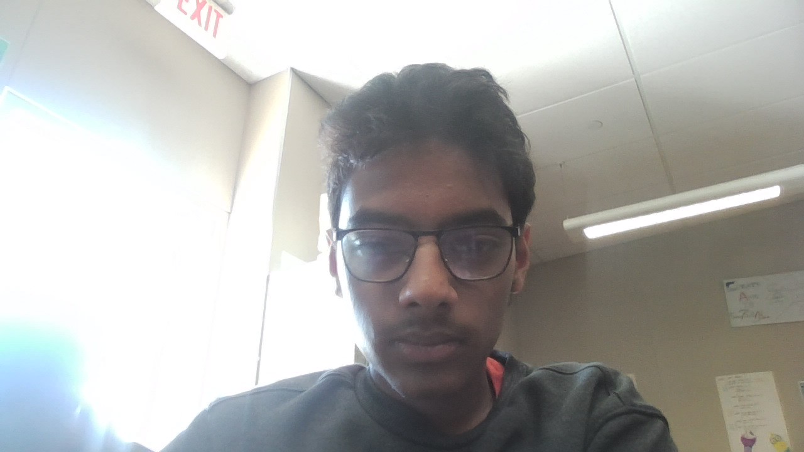

# CTE EXPO Speach

**Date:** May 21

**Location:** DNHS CSSE Class

**Extra Credit Theme:** What you saw and what you learned?

## Proof of Experience

**Caption:**  
I Was in the photo listening before the presentaiton

## Before the Event

I was expecting a normal talk of how to normal computer science is.

## Curiosity Before Attending

How He was courageous enough to take the risk.

## What I Saw

In class A101 Elihja Jhonson talked about How he started his company. I noticed when he talks he talks with confidence, talks with his hands with big gestures, insperational talking, and good pauses though his words.

## Most Interesting Thing I Saw

I Noticed how you it is easy to get a good idea, and turn it into a business. How the business strategies were used to promote the business.

## What I Learned

I learned people buy products not personaltiy, and how he was able to secure buisness deals, and show his ideas.

## What Surprised Me

How he was able to take a risk and how fast he grew. I was suprised hwo based of his name and his logo he was able to get and investor.

## What Inspired Me

The fact that he had a boring life but he took his idea and expanded. After the competition instead of focusing on clients they started focusing on promoting their idea, speeches, sponsoring a basketball team. His quote of taking the best possible outcome and taking the risk. Then scale it down to what you can do by the hour, or the day. How he talks about how to tackle big goals. Collage doesnt mater what matters is taking risk, making connections, and collage is a saftey net to find loke mineded people.

## Personal Connection

What connected is how he was able to take risks even though there was a high uncertainty. Another thing is to do anything to the best ability possible and thinking like an operator now can help me later in the future.

## Interaction

**Person or group I learned from:** Elihja Jhonson

They explained how he took risks and kept reps day in and day out doing something to make youre program 1% stronger and multimillion dollar companies are built on top of reps. He explained how discipline is better than motivation because diciplain builds things but motivation dies after a few days.

## Depth of Experience

I realized that instead of being motivated and making my motivation the reason for my drive i should build discipline over long periods of time.

## Connection to CS or Future Goals

My Projects connect with this lecture as it inspired me really inspired me to take my ideas and take these risk because, i can try and fail learn and rebuild because there are many things that i can do but never took the risk because of the faults.

## Final Reflection

This event was inspirational for me because it made me realize that i can build a better future for my self but due to my overthinking i am dragging myself down.

## Biggest Takeaway

> My biggest takeaway was to take the risk and build it up. No matter who stops you if it is not crazy enough than make it better.
